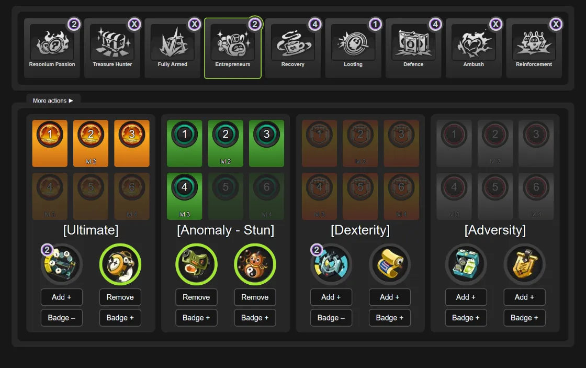

# Lost Void Tracker

Lost Void Tracker is a fan-made website. It will help you keep track of your gear challenge progress in the _Lost Void_ game mode of Zenless Zone Zero.



## Features

-   Select your current strategy.
-   Mark gear and amount of cards in your current run.
-   Mark obtained gear badges.

## Getting Started

This is a [Next.js](https://nextjs.org) project bootstrapped with [`create-next-app`](https://nextjs.org/docs/app/api-reference/cli/create-next-app).

To run this project locally:

1. Clone the repository:

    ```bash
    git clone https://github.com/Amasoken/lost-void-tracker.git
    cd lost-void-tracker
    ```

2. Install dependencies:

    ```bash
    yarn
    ```

3. Start the development server:

    ```bash
    yarn dev
    ```

4. Open your browser and navigate to http://localhost:3000.

## Motivation

I couldn't remember exactly what badges I already completed, and I wanted a nice little notepad I could keep on the second screen, or even a phone. For some time I used a file made in graphic edit software, and that looked like a nice layout template for a website, so here we are. Now I can see which badges I already have, and which cards and gear I do (not) need to collect.

## Lost Void badge collection

How to get badges?

-   Get some gear. The gear will have its' type, for example **[Ultimate]**.
-   Get cards of the same type as your gear, for example **[Ultimate]**. Every two cards will increase gear's level, up to 6 cards (gear level 4).
-   Finish your Lost Void run with gear and at least 4 cards of the corresponding type to unlock the badge _for this gear_.

Tips

-   While badge requires only 4 cards, if you get 6 cards, you will unlock gear level 4, which counts towards the collection progress ("collect gear of different levels").
-   In some runs you might be able to get 2 gears of the same type, getting an opportunity to upgrade both gear at once (and possibly getting 2 badges)
-   There's one guaranteed gear at the start of the run.
-   Don't forget to upgrade your Combat Potential nodes.

## Disclaimer

This is a fan-made website created by **Amasoken** for fellow Proxies. The website is designed to help Proxies keep track of their in-game gear badge collection for the _Lost Void_ game mode.

This project uses screenshots of in-game images and icons, particularly on the /tracker page of the website. All in-game images, icons, and related content are the property of miHoYo Co., Ltd. and its affiliates. This project is not affiliated with, endorsed by, or sponsored by miHoYo. All rights to in-game assets remain with their respective owners.

Visit the official _Zenless Zone Zero_ website here: [https://zenless.hoyoverse.com/](https://zenless.hoyoverse.com/)

## License

This project is licensed under the MIT License. See the [LICENSE](LICENSE) file for details.
